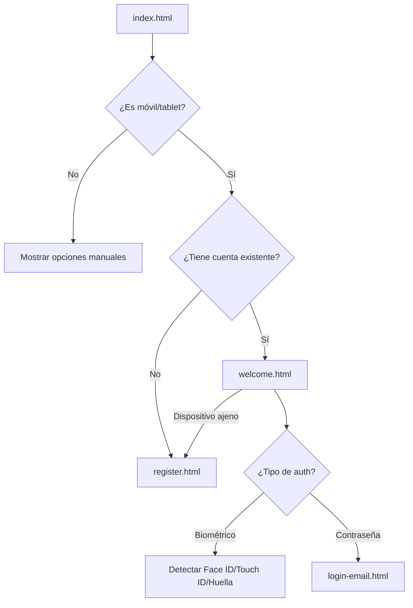

# 📱 YA ME VI - Flujo de Usuario Inteligente

## 🎯 Nuevas Funcionalidades Implementadas

### 1. **Detección Automática de Dispositivos**
- ✅ Detecta automáticamente si el usuario está en móvil/tablet
- ✅ Identifica el tipo de autenticación biométrica disponible:
  - **Face ID** 🆔 (iPhone X y superiores)
  - **Touch ID** 👆 (iPhones/iPads anteriores, MacBooks)
  - **Huella digital** 👆 (Android)
  - **Windows Hello** 🔐 (Windows)

### 2. **Flujo Inteligente por Tipo de Usuario**

#### 📱 **Usuario Nuevo en Móvil**
- **Flujo**: `index.html` → `register.html` (automático)
- **Experiencia**: 
  - Redirección automática a registro
  - Mensaje de bienvenida personalizado: "¡Bienvenido a YA ME VI! 🎉"
  - Formulario optimizado para móvil con emojis

#### 👋 **Usuario Existente en Móvil**
- **Flujo**: `index.html` → `welcome.html` (automático)
- **Experiencia**:
  - Saludo personalizado: "¡Hola de nuevo, [Nombre]!"
  - Opción principal: Autenticación biométrica con tipo específico
  - Opción secundaria: Usar contraseña
  - Opción terciaria: "¿Usas un dispositivo que no es tuyo? Crear mi propia cuenta"

#### 💻 **Usuario en Desktop**
- **Flujo**: `index.html` (manual)
- **Experiencia**: 
  - Mantiene la experiencia original
  - Botones: "Ya tengo cuenta" / "Crear cuenta"

### 3. **Páginas Nuevas y Modificadas**

#### 🆕 `welcome.html`
- Página de bienvenida para usuarios existentes
- Detección automática de tipo biométrico
- Interfaz adaptada al dispositivo del usuario
- Opciones claras para diferentes escenarios

#### 🔧 `js/deviceDetector.js`
- Clase inteligente para detección de dispositivos
- Identificación de tipos biométricos específicos
- Gestión de estado de usuario (nuevo vs existente)
- Lógica de flujo de navegación

#### 📝 Páginas Modificadas
- `index.html`: Redirección automática en móviles
- `register.html`: Mensaje de bienvenida para usuarios nuevos
- Todas las páginas mantienen compatibilidad con desktop

### 4. **Casos de Uso Cubiertos**

#### ✅ **Caso 1: Usuario nuevo en su móvil**
```
index.html → (detección automática) → register.html
```
- Ve mensaje: "¡Bienvenido a YA ME VI! Vamos a crear tu cuenta"
- Proceso de registro simplificado

#### ✅ **Caso 2: Usuario existente en su móvil**
```
index.html → (detección automática) → welcome.html
```
- Ve mensaje: "¡Hola de nuevo, [Nombre]!"
- Opción principal: Face ID/Touch ID/Huella
- Opción secundaria: Contraseña

#### ✅ **Caso 3: Usuario en dispositivo ajeno**
```
welcome.html → "Crear mi propia cuenta" → register.html
```
- Opción clara para crear cuenta independiente
- Respeta la privacidad del dispositivo

#### ✅ **Caso 4: Usuario en desktop**
```
index.html (sin redirección automática)
```
- Experiencia original preservada
- Elección manual entre login/registro

### 5. **Mejoras en UX/UI**

#### 🎨 **Detección de Biométricos**
- **Face ID**: Emoji 🆔 + "Continuar con Face ID"
- **Touch ID**: Emoji 👆 + "Continuar con Touch ID"  
- **Huella**: Emoji 👆 + "Continuar con Huella digital"
- **Genérico**: Emoji 🔐 + "Continuar con Biométrico"

#### 📱 **Optimización Móvil**
- Animaciones suaves (Animate.css)
- Efectos de cristal (backdrop-blur)
- Botones táctiles optimizados
- Mensajes contextualmente relevantes

#### 🔄 **Estados de Carga**
- Indicadores visuales durante detección
- Mensajes informativos del proceso
- Fallbacks en caso de errores

### 6. **Flujo Técnico**



### 7. **Tecnologías Utilizadas**

- **WebAuthn API**: Para autenticación biométrica
- **Firebase Auth**: Para gestión de usuarios
- **LocalStorage**: Para datos biométricos locales
- **User Agent**: Para detección de dispositivos
- **Tailwind CSS**: Para diseño responsivo
- **Animate.css**: Para animaciones suaves

### 8. **Próximas Mejoras Sugeridas**

- [ ] Integración con Apple Keychain/Google Password Manager
- [ ] Notificaciones push para recordatorios
- [ ] Sincronización de preferencias entre dispositivos
- [ ] Análisis de patrones de uso para optimización
- [ ] Soporte para más tipos de autenticación (PIN, patrón)

---

## 🚀 **Resultado Final**

La aplicación ahora ofrece una experiencia **completamente intuitiva** que:

1. **Reconoce automáticamente** el contexto del usuario
2. **Adapta la interfaz** al tipo de dispositivo
3. **Personaliza el saludo** para usuarios existentes  
4. **Optimiza el flujo** para cada caso de uso
5. **Mantiene la flexibilidad** para diferentes escenarios

**¡La aplicación es ahora verdaderamente inteligente y centrada en el usuario! 🎉**
