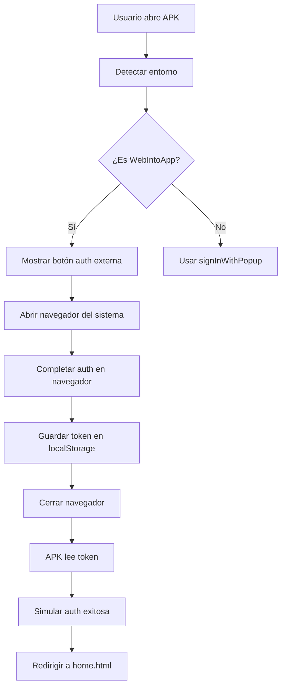

# SOLUCIÓN COMPLETA APK - GOOGLE AUTH

## PROBLEMA IDENTIFICADO
El error "Unable to process request due to missing initial state" en el APK de WebIntoApp es causado por:

1. **Limitaciones de WebView**: `signInWithRedirect` no funciona correctamente en WebView apps
2. **sessionStorage restringido**: Firebase Auth no puede mantener el estado entre redirects
3. **Dominios no configurados**: Faltan URLs del APK en las configuraciones de autenticación

## SOLUCIÓN IMPLEMENTADA

### 1. DETECCIÓN AVANZADA DE WEBVIEW
- Detección específica para WebIntoApp
- Identificación de capacidades de almacenamiento
- Selección automática del método de autenticación óptimo

### 2. MÉTODOS DE AUTENTICACIÓN MÚLTIPLES
- **Navegador normal**: `signInWithPopup`
- **WebView básico**: `signInWithRedirect` 
- **WebIntoApp**: Autenticación externa en navegador del sistema

### 3. ARCHIVOS CREADOS
```
login-apk-fixed.html         - Login optimizado para APK
auth-external.html           - Página de autenticación externa
js/firebase-init-apk-v2.js   - Configuración específica para APK
```

## CONFIGURACIONES REQUERIDAS

### FIREBASE CONSOLE
1. **Authentication > Settings > Authorized Domains**
   Agregar todos estos dominios:
   ```
   ya-me-vi.firebaseapp.com
   yamevi.com.mx
   gfigueroa.github.io
   localhost
   127.0.0.1
   webintoapp.com
   ```

### GOOGLE CLOUD CONSOLE
2. **APIs & Services > Credentials > OAuth 2.0 Client**
   Agregar estas URIs de redirección:
   ```
   https://ya-me-vi.firebaseapp.com/__/auth/handler
   https://yamevi.com.mx/__/auth/handler
   https://yamevi.com.mx/auth-external.html
   https://gfigueroa.github.io/ya-me-vi/__/auth/handler
   http://localhost:8080/__/auth/handler
   http://127.0.0.1:8080/__/auth/handler
   ```

### WEBINTOAPP.COM CONFIGURACIÓN
3. **App Settings**:
   - ✅ Enable JavaScript
   - ✅ Enable Local Storage
   - ✅ Enable Cookies
   - ✅ Allow External Links
   - ✅ Allow Popups
   - 🔗 Set URL: `https://yamevi.com.mx/login-apk-fixed.html`

## IMPLEMENTACIÓN

### Paso 1: Actualizar login principal
Reemplazar el archivo de login actual con `login-apk-fixed.html`:

```bash
# Hacer backup del login actual
cp login.html login-backup.html

# Usar la nueva versión
cp login-apk-fixed.html login.html
```

### Paso 2: Configurar dominios
1. Firebase Console → Authentication → Settings → Authorized domains
2. Google Cloud Console → APIs & Services → Credentials
3. Agregar todos los dominios listados arriba

### Paso 3: Probar la implementación
1. **En navegador web**: Debe usar `signInWithPopup`
2. **En APK**: Debe detectar WebView y usar autenticación externa
3. **Verificar logs**: Revisar la consola para ver el método usado

## FLUJO DE AUTENTICACIÓN APK



## VERIFICACIÓN DE LA SOLUCIÓN

### Logs esperados en APK:
```
🔍 Entorno detectado: { isWebIntoApp: true, compatibilityLevel: "LIMITED" }
⚠️ Entorno WebView detectado
📱 Usando método de autenticación optimizado
🌐 Abriendo autenticación externa
✅ Token externo encontrado: usuario@email.com
✅ Usuario externo registrado en Firestore
📢 Notificación de auth enviada
```

### En caso de problemas:
1. **Verificar configuración de dominios** en Firebase y Google Cloud
2. **Revisar configuración de WebIntoApp** (JavaScript, localStorage, cookies)
3. **Comprobar conectividad** del dispositivo
4. **Verificar logs de la consola** del navegador

## ARCHIVOS DE DIAGNÓSTICO

Para depurar problemas, usar:
- `diagnostico-apk-google-auth.html` - Diagnóstico completo del entorno
- Logs detallados en consola del navegador
- Verificación de capacidades de almacenamiento

## NOTAS IMPORTANTES

1. **Seguridad**: La autenticación externa mantiene la seguridad de Firebase Auth
2. **UX**: El usuario verá brevemente el navegador externo, esto es normal
3. **Compatibilidad**: Funciona tanto en APK como en navegador normal
4. **Fallbacks**: Múltiples métodos de respaldo en caso de fallos

---

**RESULTADO ESPERADO**: El login con Google funcionará correctamente tanto en navegador web como en la APK generada por WebIntoApp, eliminando el error "missing initial state".
